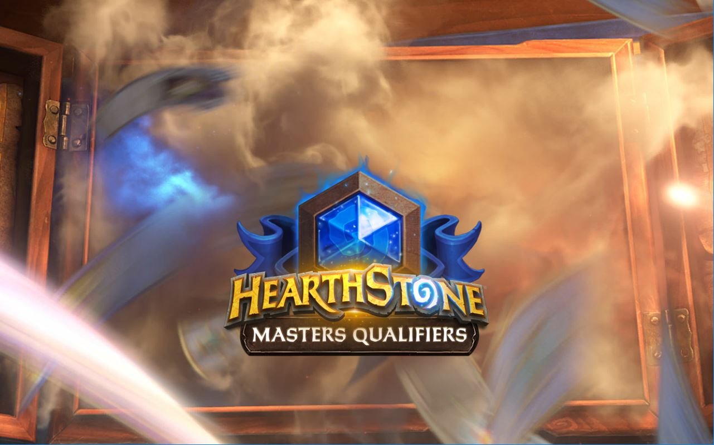
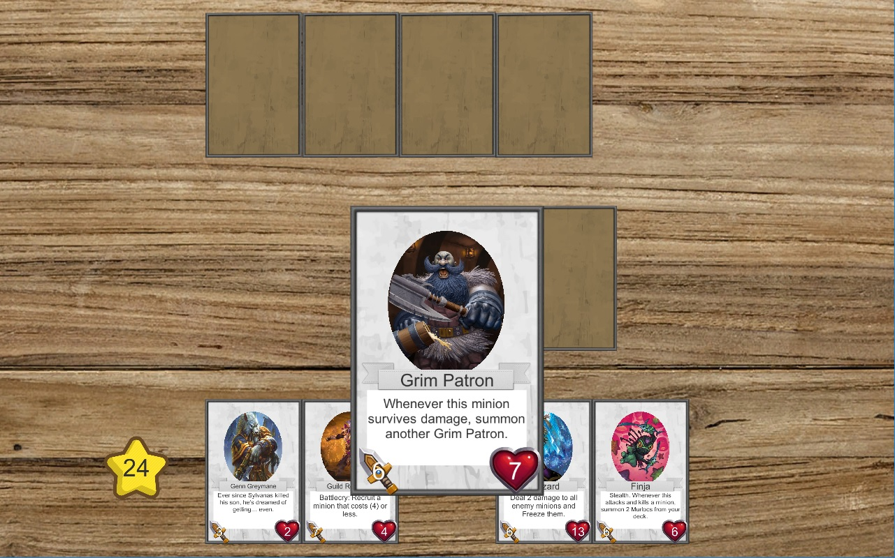
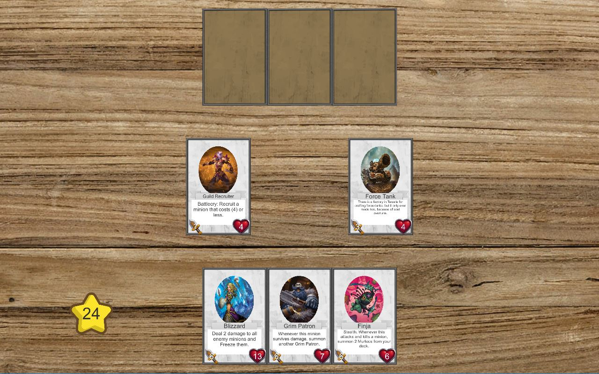
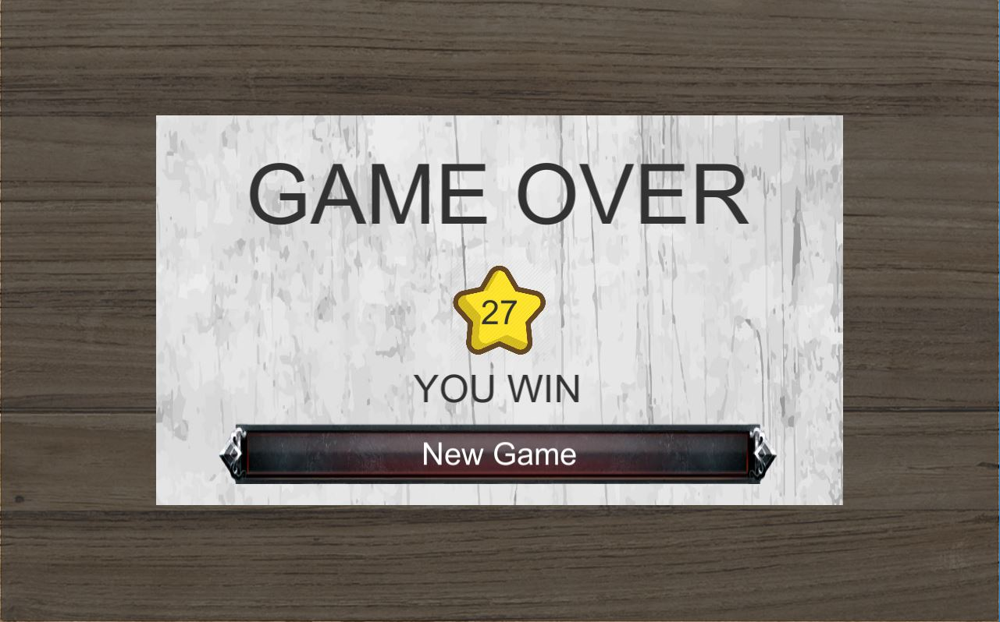

# Simple Card Collecting Game

## The Story

Create a very simple card collecting game for a player. At the beginning of the game, ten (10)
cards will be mixed while undecked (animation - and the player does not see the
numbers/pictures) and then fanned out with the player still only seeing the backside of the
cards. The player then selects their first card. This card then roams into their own still empty
deck of cards, which is located on the lower edge of the screen. The cards turn over in the
process such that the player has a view of the card characteristics. This procedure is repeated
four (4) times until the player has ultimately selected five (5) cards.

The computer player receives the 5 remaining cards. Its cards roam into the upper portion of the
screen, where they remain uncovered. It’s now the computer’s turn and it plays its first card.
This turns over and lands in the middle of the screen. The player can now select one of his/her
cards and places it next to the computer opponent’s card. The value of the card determines who
has won the card battle. The winner receives one point. The winning card remains on the
playing field. The game concludes as soon as the last card has been played out. The player
with the most points wins.

## The Rules

The player who places the last card, is automatically the attacker. There are attacking points for
this. The attacking points are directly deducted from the life points of the opponent’s card. The life points of the attacking player are automatically reduced by the amount of the attacking
points. Once there are zero (0) life points, the card disappears from the playing field

## 3rd Asset

* DOTween (HOTween v2)
* Card Image and Description collected from [hearthstone](https://hearthstone.gamepedia.com/Full_art)

## Features

1. The cards should be made possible with the aid of scriptable objects
1. The mixing, distribution, and placement of the cards is to be done with animation or via
mouse control
1. UI for points and ending the application
1. The score (i.e. status of the game) should be saved and it should be possible to pick up
where you left off at any time (i.e. when ending the application)
1. Points should be displayed and updated right on the cards themselves (i.e. attack/life
points)
1. Every card should illustrate/display another avatar and an individual text. The framework
remains the same.
1. The game should have an intro screen and should be able to subsequently load the
game scene.
1. The app should work on multiple aspect ratios

## Setup and Run

* Working with Unity 2018.3.0f2. Haven't tested yet with another Unity version.
* Run Scene\IntroScene to enjoy the game.

## Assumptions

* _The user has higher health value will win and the loss card will be destroyed from play field._
* If both cards return their health by less or equal 0 -> _no point for both player._
* _The win card still keep on play field for next battle with health reducing by competitor attack value._

## TODO
* Intergrate __Command Pattern__ to control command list better.
* Save game just support _score_ by now, but when save game file expand, the saving should be perform on __thread__.

## Design Screenshot

1. __Intro Scene__

* It's display in 2 second, then switch to game scene.

2. __Game Scene__

* Player pick 5 cards to play.
* The rest will be transfered to AI.

* Click to choose the card to battle.

* The user has higher health value will win and the loss card will be destroyed from play field.
* The winner receive 1 score.

* Display _pLayer_ status. (_Win/Loss/Draw_)
* Click __New Game__ to start new battle

